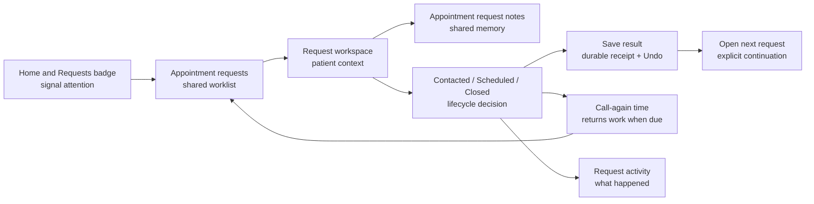

> **Status (2026-08-01): superseded where it conflicts with the glossary.** This draft
> was annotated but never accepted; its "Protected familiarity contract" does not bind.
> In particular, the invariant that the staff destination remains "Appointment requests"
> is overturned: the destination renames to "Appointments" under the reserved-word model
> recorded in `CONTEXT.md` and `docs/adr/0002-appointment-names-the-booked-visit.md`.
> Where this brief and those documents disagree, they win.

# Instructions for the revising collaborator

The annotations below are anchored to the canonical manuscript included later in this file. Apply them deliberately, preserve the document's voice and evidence discipline, and report any conflict instead of silently choosing between incompatible directions.

# Product Brief annotation

Generated 7/29/2026, 8:48:26 PM

Open annotations: 4

> Apply these notes against the accompanying canonical manuscript. Preserve passages explicitly marked **Keep** unless a conflicting annotation says otherwise.

> The manuscript is rendered by a purpose-built reader with structural rules: sections are `#` and subsections `##`, the lines above the first heading are a positional cover block, diagrams are images in `public/` rather than Mermaid, and footnotes use `[^n]` markers defined at the end. See `docs/MANUSCRIPT_CONTRACT.md` and verify with `npm run check:manuscript`.

## Executive decision

### 1. Comment

> shared worklist

I.E, correct me if im wrong, your proposing to make the appointment request lifecycle, thus the entire portal, more stateful and more relevant to what matters right now. with that being said: 
what if in fact Appointment requests as a tab -- becomes Appointments and beneath appointments lives much of the logic your proposing. the staff portal home screen could remain but serve as a snapshot - it currently already is a snapshot in essence plus a quick nav menu.
but this new snapshot could be way more informative(not reccomending to clobber the card with prose and information). Currently, the home screen gives you, on the left side, a snapshot of appointment requests, and then, like I mentioned, on the right side, a quick nudge around the portal. There's so much more information to be had at a glance, though, because currently it tells you:
- how many new appointment requests are waiting
- how old the oldest one has been sitting for
- just three random individuals who have submitted an appointment request I assume that these are the three most recent, but you want to know something: when it comes down to scheduled patients, they kind of just fizzle off in our appointment request workflow. There's no calendar; they just simply don't resurface. It's almost like the staff has to remember this, or it's like we're almost counting on them having backup software via FDHS that handles this. I would argue that they prefer this software, ours, so the home screen not even telling us how many scheduled appointments we have for today, I think, is a huge miss. Hinting towards why I am mentioning that appointment request be renamed to just appointments, because within appointments, can live:
- all appointments
- new requested appointments
- contacted requested appointments
- scheduled appointments
- closed appointments

So you see how this is not separated between two distinct things: requested appointments and appointments.

I think we are closing in on some good stuff here.

### 2. Protect this

> New, Contacted, Scheduled, and Closed

No additional note supplied.

### 3. Open question

> Call again

i think can maybe be demoted as a sub action of something else? I almost feel like this should exist in something as part of a dropdown menu or as a drawer or something like that. I don't think it should be its own unique button. You know what I mean?

### 4. Propose rewrite

> Request activity

So I was thinking about this earlier. Request activity is nothing more than just an "appointment's history".-- see what i did there.

**Proposed replacement**

Appointment History (appointment history can consist of:
- the amount of calls that have occurred
- when they occurred
- staff notes, etc. 
- Date and times of when the appointment moved along the workflow pipeline)

# Machine-readable annotation payload

```json
{
  "schema": "platform-for-human-potential.editorial-context.v1",
  "document": {
    "title": "A Science of One — Platform for Human Potential",
    "version": "2.0",
    "source": "paper.md"
  },
  "exportedAt": "2026-07-30T00:48:26.954Z",
  "annotations": [
    {
      "id": "ac722a64-5d6e-417a-b9b9-bab256191879",
      "type": "comment",
      "status": "open",
      "quote": "shared worklist",
      "prefix": "The appointment-request experience should become a ",
      "suffix": ", not a redesigned status tool.",
      "blockId": "executive-decision:p:s3zu4s",
      "sectionId": "executive-decision",
      "sectionTitle": "Executive decision",
      "note": "I.E, correct me if im wrong, your proposing to make the appointment request lifecycle, thus the entire portal, more stateful and more relevant to what matters right now. with that being said: \nwhat if in fact Appointment requests as a tab -- becomes Appointments and beneath appointments lives much of the logic your proposing. the staff portal home screen could remain but serve as a snapshot - it currently already is a snapshot in essence plus a quick nav menu.\nbut this new snapshot could be way more informative(not reccomending to clobber the card with prose and information). Currently, the home screen gives you, on the left side, a snapshot of appointment requests, and then, like I mentioned, on the right side, a quick nudge around the portal. There's so much more information to be had at a glance, though, because currently it tells you:\n- how many new appointment requests are waiting\n- how old the oldest one has been sitting for\n- just three random individuals who have submitted an appointment request I assume that these are the three most recent, but you want to know something: when it comes down to scheduled patients, they kind of just fizzle off in our appointment request workflow. There's no calendar; they just simply don't resurface. It's almost like the staff has to remember this, or it's like we're almost counting on them having backup software via FDHS that handles this. I would argue that they prefer this software, ours, so the home screen not even telling us how many scheduled appointments we have for today, I think, is a huge miss. Hinting towards why I am mentioning that appointment request be renamed to just appointments, because within appointments, can live:\n- all appointments\n- new requested appointments\n- contacted requested appointments\n- scheduled appointments\n- closed appointments\n\nSo you see how this is not separated between two distinct things: requested appointments and appointments.\n\nI think we are closing in on some good stuff here.",
      "createdAt": "2026-07-30T00:44:28.300Z"
    },
    {
      "id": "baca739c-e4cb-4c34-a37f-56efae652a7f",
      "type": "keep",
      "status": "open",
      "quote": "New, Contacted, Scheduled, and Closed",
      "prefix": "",
      "suffix": "",
      "blockId": "executive-decision:li:n7rjo2",
      "sectionId": "executive-decision",
      "sectionTitle": "Executive decision",
      "note": "",
      "createdAt": "2026-07-30T00:44:46.338Z"
    },
    {
      "id": "1e3bbda5-e86e-4cd8-addb-d8c939b25800",
      "type": "question",
      "status": "open",
      "quote": "Call again",
      "prefix": "",
      "suffix": "",
      "blockId": "executive-decision:li:1o4ez5d",
      "sectionId": "executive-decision",
      "sectionTitle": "Executive decision",
      "note": "i think can maybe be demoted as a sub action of something else? I almost feel like this should exist in something as part of a dropdown menu or as a drawer or something like that. I don't think it should be its own unique button. You know what I mean?",
      "createdAt": "2026-07-30T00:45:41.457Z"
    },
    {
      "id": "fe7b159e-f717-4a88-8d87-8328a43bbf96",
      "type": "rewrite",
      "status": "open",
      "quote": "Request activity",
      "prefix": "",
      "suffix": "",
      "blockId": "executive-decision:li:1ns567f",
      "sectionId": "executive-decision",
      "sectionTitle": "Executive decision",
      "note": "So I was thinking about this earlier. Request activity is nothing more than just an \"appointment's history\".-- see what i did there.",
      "replacement": "Appointment History (appointment history can consist of:\n- the amount of calls that have occurred\n- when they occurred\n- staff notes, etc. \n- Date and times of when the appointment moved along the workflow pipeline)",
      "createdAt": "2026-07-30T00:47:16.828Z"
    }
  ]
}
```

# Canonical manuscript

# Staff Portal Product Brief

## The shared appointment-request worklist

**Date:** July 29, 2026  
**Status:** Product direction and implementation plan; no code or data changes are authorized by this brief  
**Surface:** Staff portal Home, Appointment requests queue, and appointment-request detail  
**Experience mode:** Operate  
**Primary audience:** Front-desk staff and the practice manager  
**Working thesis:** Restore trust by making the existing appointment-request abstractions work as one calm, reliable daily-work system.

---

## Executive decision

The appointment-request experience should become a **shared worklist**, not a redesigned status tool.

“Shared worklist” is the internal product model. It does not replace any staff-facing language. Staff should continue to see and use:

- **Appointment requests**
- **Appointment request notes**
- **New, Contacted, Scheduled, and Closed**
- **Call again**
- **Save**
- **Undo**
- **Request activity**
- Search, status filters, printing, and previous/next request navigation

The larger idea gives each existing abstraction one clear job:

- The **queue** says what deserves attention.
- The **status** says where a request belongs.
- The **call-again time** says when it should return.
- **Appointment request notes** say what the next staff member needs to know.
- **Request activity** proves what happened.
- **Undo** makes a recent mistake recoverable.
- **Next request** preserves momentum without taking control away.
- Printing supports the clinic’s physical handoff when paper is the practical tool.

The product promise is:

> Every appointment request has an obvious next action, one familiar place for staff context, a truthful state, and a safe way forward. The worklist remembers so staff do not have to.

The emotional outcome is **calm control**: staff can leave the queue knowing that work needing attention is visible, future work will come back at the right time, and a colleague can continue without reconstructing what happened.

The first release should be a familiarity-preserving refinement using the data and operations that already exist. It should not add a status, force a wizard, merge notes into outcomes, introduce assignment, create a dashboard, or attempt an ECW integration.

---

## Why this matters now

The appointment-request workflow has become an everyday clinic tool. That is stronger product evidence than the original expectations for the portal.

The direct report behind this brief is also a warning: changing or removing familiar abstractions caused a staff complaint, and staff then appeared to avoid the workflow. The exact causal chain has not been directly observed, so it should not be presented as measured behavior. It is still sufficient evidence to make **familiarity and reversibility release gates**, not aesthetic preferences.

The clinic champion’s interest in a possible eClinicalWorks connection signals appetite for a deeper operational role. It does not yet establish technical feasibility, authorization, vendor access, or the right product boundary. The immediate responsibility is to make the existing workflow dependable enough to deserve that expansion.

The desired result is not merely more portal activity. A usage spike caused by curiosity would prove little. The meaningful outcome is that staff voluntarily return to the portal because it helps them finish callback work with less mental bookkeeping and fewer missed handoffs.

---

## Evidence boundary

This direction is grounded in:

- The current staff-portal product register and its stated north star.
- The committed design system.
- The current Home, Appointment requests queue, request-detail, notes, outcome, follow-up, activity, navigation, and print implementations.
- The checked-in desktop and mobile portal references.
- The current end-to-end scenarios for queue ordering, lifecycle updates, follow-up, notes, Undo, continuation, printing, and failures.
- The direct report supplied with this task about staff reliance, the complaint, and the clinic champion’s interest.

This assessment intentionally did **not** inspect Git history or prior pull requests.

It also did not observe staff using the portal, interview clinic staff, or inspect real patient records. It did not use a live authenticated portal session. Any statement about hesitation, interruption cost, or preferred workflow is therefore a design hypothesis, not an observed fact.

The first implementation should be paired with a short, synthetic-data workflow observation and aggregate, PHI-free evidence. No heatmaps, session replay, per-person productivity scoring, search-term capture, or patient-level journey tracking should be introduced.

---

## Job, audience, and use scene

### Primary job

Turn a patient’s callback request into a completed or deliberately deferred piece of front-desk work while preserving enough shared context for another staff member to continue safely.

### People

Front-desk staff and the practice manager are not operating a software system for its own sake. They are answering calls, speaking with patients, working around interruptions, checking schedules, and handing work to colleagues. The portal is opened between those activities, usually on a front-desk desktop and sometimes on a phone.

### Use scene

The interface is frequently entered mid-shift and mid-thought. A staff member may:

- Have only a minute before the next call.
- Be returning to a request someone else touched.
- Need to make a callback now.
- Need to defer a callback to a meaningful future time.
- Need to record context without changing lifecycle state.
- Need to correct the result they just saved.
- Need to locate an older Scheduled or Closed request.
- Be interrupted after reading the request but before saving an outcome.

The interface must therefore optimize for resumption, shared memory, and certainty after save—not for novelty or maximum visual density.

### Success

A new hire should be able to:

1. See what needs attention.
2. Open the top request.
3. Understand whom to contact and why.
4. Read or add Appointment request notes in the familiar place.
5. Choose Contacted, Scheduled, or Closed.
6. Provide only the information that status requires.
7. Understand what Save will do before choosing it.
8. Confirm what actually happened after the durable save.
9. Undo an immediate mistake or continue to the next request.

They should accomplish this without learning database concepts, status/classification distinctions, notification-provider terminology, repository vocabulary, or a new workflow metaphor.

---

## Protected familiarity contract

These are product invariants for the appointment-request experience.

### Vocabulary that stays

- The main destination remains **Appointment requests**. “Requests” may remain the compact phone label.
- Staff context remains **Appointment request notes**. Do not rename it Comments, Timeline, Handoff, History, or Activity.
- The lifecycle remains **New, Contacted, Scheduled, Closed**.
- **Request activity** remains the record of call outcomes and status changes. It must not absorb or masquerade as Appointment request notes.
- The primary commit action remains **Save**.
- The immediate correction remains **Undo**.

### Behavior that stays

- The queue remains the system of record even when email delivery fails.
- New requests and due work remain ahead of reference/archive material.
- Direct New to Scheduled remains a valid and normal path.
- The current status is not offered as a destination.
- Contacted reveals contact outcomes and callback timing.
- Scheduled means the appointment is booked and remains findable.
- Closed removes the request from active work and records why it is complete.
- A Closed request can be reopened as Contacted or Scheduled.
- Appointment request notes can be added without changing status.
- One Save commits outcome, status, callback timing, and closure details together.
- Success appears only after the durable operation is confirmed.
- Failure and unknown outcomes remain distinct and preserve staff input.
- Undo restores the prior lifecycle state without erasing the recorded activity.
- Opening the next request is explicit. The portal never auto-advances.
- Search and status filters remain available.
- The complete patient handoff remains printable without portal controls or notification diagnostics.

### Things this work must not introduce

- A forced linear funnel.
- A kanban board.
- Bulk status changes.
- A replacement notes abstraction.
- A new status such as “Working,” “Pending,” or “Sent to ECW.”
- A modal for routine request work.
- Auto-advance after Save.
- A staff leaderboard or vanity dashboard.
- A placeholder assistant.
- A placeholder ECW control that does nothing.
- An autonomous action over patient data.

---

## What is already strong

The current product contains the right raw materials:

- Home treats the queue as the portal’s heartbeat and distinguishes an empty queue from an unavailable read.
- The queue uses business language such as “Waiting since Friday,” “Call again,” and “Silent since Tuesday.”
- Open requests are ordered by attention, not merely by creation time.
- New, due follow-up, stale, future follow-up, Scheduled, and Closed requests already have distinct operational meaning.
- Status vocabulary is consistent between queue and detail.
- Patient context leads request detail.
- Appointment request notes are one first-class, attributed surface.
- The outcome composer asks only for details relevant to the selected status.
- The combined save is atomic.
- Save, success, failure, Undo, and stale-Undo states are already modeled.
- Previous/next continuity preserves the queue’s scope.
- Printing supports the clinic’s paper workflow.
- Notification diagnostics are separated from the patient-facing email itself.
- The implementation already honors a PHI-minimal posture and server-authorized mutations.

The vision should reveal and connect these strengths. It should not replace them.

---

## Experience assessment

| Before | After | Why |
| --- | --- | --- |
| Home primarily reports the number of New requests. Due callbacks and silent Contacted requests become visible only after entering the queue. | Home reports one truthful **needs-attention** total, with a short breakdown such as New, callbacks due, and waiting without a return time. | The staff member’s real job is all work needing action now, not only newly arrived inventory. |
| The default queue orders attention first but visually continues into future, Scheduled, and Closed rows as one list. | The same rows are given explicit worklist sections: **Needs attention**, **Waiting to return**, **On the schedule**, and archive access through All/Closed. Existing statuses and filters stay intact. | Ordering alone asks staff to infer where active work ends. Sections make the work contract visible without inventing another lifecycle. |
| Search, Export CSV, status filters, and daily work begin at similar visual weight. | Starting the top request is the dominant path; search, filters, and export stay available as clearly labeled utilities. | High-frequency work should be obvious before occasional retrieval and export tasks. |
| A queue row contains patient identity, preference, received time, waiting age, next-action hint, and status, but the action sentence changes position by state. | Every active row uses one predictable hierarchy: patient, **next action**, supporting context, lifecycle status. | Consistent mapping reduces rescanning and helps staff resume after interruption. |
| Status chips overflow horizontally on a 390px phone, and the final choices can be partially hidden without a strong continuation cue. | Preserve all status filters, but make the mobile treatment self-evident through wrapping or an explicit scroll edge/continuation affordance. | Hidden horizontal controls reduce discoverability and agency on the secondary device staff actually use. |
| Request detail gives contact information, source metadata, and submission metadata similar visual weight. | Phone, email, office/time preference, reason, and current status form a compact call-first header; source page and submission metadata remain available as secondary details. | The request page should lead with what staff need during the call while retaining the complete record. |
| Appointment request notes and the lifecycle composer are correctly colocated, but the page still reads as a sequence of record cards rather than one work loop. | Patient context, Appointment request notes, and status update are composed as one **request workspace** while remaining separate, named abstractions. | Visual continuity can connect the work without merging data models or changing familiar concepts. |
| The exact consequence of a choice is fully stated after Save. Before Save, staff must infer how status, callback timing, and queue placement will combine. | A live plain-language preview says, for example, “Saving will mark this Contacted and bring it back tomorrow morning.” | Showing the result before commit builds confidence and reduces corrective work without adding confirmation dialogs. |
| Success feedback is correct and focused, while Undo and the next-request action compete inside a paragraph and may move after refresh. | A stable completion area beside the changed workflow shows the saved result, Undo, and a separate Next request action. | Completion, forgiveness, and continuation are three distinct decisions and should remain visually distinct. |
| Request activity and notification delivery each occupy full secondary cards on the daily-work page. | Request activity remains available and printable; delivery diagnostics move into a clearly secondary disclosure or admin-oriented detail. | Operational evidence should not compete with the call and handoff work staff perform repeatedly. |
| “This afternoon,” “Tomorrow morning,” and “Friday” are convenient labels, but their calendar behavior can produce surprising weekend or already-past return times. | Quick choices are generated from practice business time: Later today only when meaningful, Next business morning, the next named business day, and Pick a day. | A call-again choice is a promise that the worklist will remember; its label and return behavior must agree. |
| Product usage is described through support messages and intuition; there is no evidence in this review about completion, hesitation, or abandonment. | Pair release with synthetic-data observation and aggregate outcome, failure, Undo, continuation, and queue-debt measures. | The team needs evidence about whether trust and task completion improved without surveilling staff or patients. |

---

## Selected direction: the Shared Worklist

“Shared Worklist” is an internal product concept, not a new navigation label and not a new database status.

Staff continue to enter **Appointment requests**. Inside it, the interface makes a simple contract explicit:

1. If a request is under **Needs attention**, someone should act.
2. If staff choose a future call-again time, the request leaves immediate attention and returns when due.
3. If an appointment is Scheduled, it stays easy to find but does not masquerade as unfinished callback work.
4. If a request is Closed, it leaves active work but remains searchable and recoverable.
5. Appointment request notes preserve the team handoff regardless of lifecycle movement.
6. Request activity provides the durable receipt.



This model is useful because it turns status and follow-up from recordkeeping fields into a dependable attention system. It also creates a clean future seam for an external schedule or record system without making that integration the portal’s new organizing principle.

---

## North-star walkthrough

The following is an illustrative scenario using synthetic content. It is a design test, not a claim about observed clinic behavior.

At 8:07 AM, a front-desk staff member opens Home. The appointment-request area says:

> **6 appointment requests need attention**  
> 3 new · 2 callbacks due · 1 waiting since Tuesday

The primary action is **Start with the oldest request**. A secondary action opens the complete Appointment requests list.

The worklist opens with an explicit **Needs attention** heading. The first row says:

> New · Waiting since Friday  
> Maria Example  
> Tampa · Morning

The staff member opens it. The request workspace keeps the patient’s name, current New status, phone number, office/time preference, and reason together at the top. Appointment request notes appear in their familiar section. No note exists, so the empty state explains that notes are for the next staff member and that clinical details stay in the clinical record.

The staff member calls and reaches voicemail. In **Update appointment request status**, they choose:

1. Contacted
2. Left a voicemail — call again
3. Next business morning

Before Save, the page states:

> Saving will mark this Contacted and bring it back Monday morning.

After the durable save completes:

> Saved as Contacted. This request will return Monday morning.

Undo is available next to that receipt. **Open next appointment request** is a separate action. Nothing advances automatically.

On Monday, the request returns under Needs attention with:

> Call again — due this morning

A colleague opens it, sees the same Appointment request notes surface, reads the prior call outcome under Request activity, calls again, books the appointment, chooses Scheduled, and saves. The request leaves Needs attention but remains findable under Scheduled and search.

The value is not a flourish. It is that the interface keeps a promise across shifts.

---

## Information architecture

### 1. Home: the shift signal

Home should answer one question before anything else:

> Is there appointment-request work that needs attention now?

Recommended behavior:

- Replace the New-only headline with an aggregate needs-attention headline derived from existing attention rules.
- Include a short, plain-language breakdown: New, callbacks due, and silent Contacted requests.
- Show the oldest or most overdue business-time context.
- Keep a compact preview of the first few worklist items.
- Use **Start with the oldest request** when work exists.
- Use **Open appointment requests** as the complete-list action.
- Preserve the zero-active-recipient and delivery-failure warnings.
- Preserve the honest unavailable state. A failed attention read suppresses the badge/count; it never produces “0.”

The Requests navigation badge should use the same needs-attention definition as Home and the worklist. Its accessible label should say that the number needs attention. This avoids three competing interpretations of the same amber number.

### 2. Appointment requests: the shared worklist

The recommended default view is **Needs attention**, not All.

This is a view, not a status. It is composed from existing state:

- New requests, oldest first.
- Contacted requests whose call-again time is today or past.
- Contacted requests that have gone silent since the prior practice-local business morning and have no call-again time.

The remaining material stays available without competing with immediate work:

- **Waiting to return:** Contacted requests with a future call-again time.
- **On the schedule:** Scheduled requests.
- **All requests:** the complete list, including Closed.
- The existing New, Contacted, Scheduled, and Closed filters remain available.
- Search remains able to find active and historical requests by name, phone, or email.
- Export CSV remains available but visually secondary to the worklist.

Recommended row hierarchy:

1. Patient name.
2. One next-action line in a consistent position.
3. Phone and office/time preference.
4. Received/waiting context.
5. Existing lifecycle status badge.

Example next-action lines:

- **New · Waiting since Friday**
- **Call again · Due this morning**
- **Call again · Friday morning**
- **Needs a return time · Silent since Tuesday**
- **On the schedule**

The row remains one clear link to request detail. Do not add inline lifecycle mutations or swipe actions to the list. Staff should see patient context and notes before changing state.

Queue scope must continue into detail. If staff entered from Needs attention, Contacted, Scheduled, Closed, or search, Previous/Next and post-save continuation should follow that same set in the same order.

### 3. Request detail: the request workspace

The request-detail page should feel like a place to do one piece of work, not a stack of database sections.

#### Call-first header

Keep visible at the top:

- Patient name.
- Current lifecycle status.
- Phone as a real call link.
- Email or the current phone fallback.
- Preferred office and time.
- Received/waiting context.
- Print patient page as a secondary utility.
- Back to the current worklist scope plus Previous/Next position.

The patient’s optional reason remains prominent and is treated as potentially sensitive. Submission language, source page, and other diagnostic metadata remain available, but they should not compete with the call.

#### Request workspace body

On desktop:

- Use a full-width patient-context band.
- Place **Appointment request notes** and **Update appointment request status** in a balanced working layout so notes can be read while the next lifecycle state is chosen.
- Preserve DOM and keyboard order: patient context, Appointment request notes, then status update.
- Avoid nested scrolling. A sticky status area may remain in view only while its own content fits naturally.

On mobile:

- Use one column.
- Keep call/contact actions near the top.
- Appointment request notes remain before status update.
- Actions remain full-width or comfortably paired at 44px minimum height.
- Previous/Next remain explicit text controls, not gesture-only navigation.

#### Secondary record

Below the active workspace:

- Request activity remains a chronological, plain-language record and remains included in print.
- Notification delivery becomes a secondary disclosure labeled in staff language, such as **Email alert delivery**.
- Raw provider states stay out of the primary workflow.

### 4. Appointment request notes: protected shared memory

Appointment request notes remain:

- One named section.
- Readable before the status workflow.
- Newest first with staff display name and practice-local time.
- Addable without lifecycle movement.
- Independent from call outcome persistence.
- Included in print.
- Guided by “Keep medical details in the clinical record.”

Refinements should give this existing abstraction more purpose:

- Empty state: “No appointment request notes yet. Add one when the next staff member needs context.”
- Keep **Add note** in the section header.
- Preserve the draft and error message when save is unconfirmed.
- Keep the compact initial view and reveal earlier notes without navigating away.
- After a successful add, leave the new note visibly attached to this surface.

Do not place another note input inside the lifecycle composer. A second entry point would recreate the exact ambiguity this direction is meant to remove.

### 5. Lifecycle update: state with a visible consequence

Keep the current status-first sequence:

1. Choose Contacted, Scheduled, or Closed.
2. Reveal only the details that destination needs.
3. Choose a call-again time when applicable.
4. Review the plain-language consequence.
5. Save once.

The current status remains visible and omitted from the destination choices.

Add a live consequence sentence above Save:

- “Saving will mark this Contacted.”
- “Saving will mark this Contacted and bring it back tomorrow morning.”
- “Saving will mark this Scheduled. It will remain on the Scheduled list.”
- “Saving will close this request as no appointment booked.”
- “Saving will reopen this request as Contacted.”

This preview is not a confirmation dialog. It is a continuously updated explanation of the selected state.

The call-again choices should use business time:

- **Later today** only while that time is still meaningful.
- **Next business morning**, skipping weekends and any confirmed closure calendar available to the product.
- A relevant named day such as **Friday morning** only when it resolves unambiguously.
- **Pick a day**, with the resulting practice-local time stated before Save.

The server remains the authority for the resolved timestamp. The interface must never promise Monday while persisting Saturday.

### 6. Save, failure, Undo, and continuation

The affected controls respond immediately while the durable operation is pending. The rest of the page remains readable.

After confirmed success, show a stable completion area containing:

- The resulting lifecycle status.
- The resolved return time or closure meaning, if applicable.
- Undo, when the saved operation is still eligible.
- A separate **Open next appointment request** action when another scoped request exists.
- A return-to-worklist action when there is no next request.

Do not auto-advance. Staff may need to verify the result, read the activity receipt, print, or correct the operation.

Failure states:

- **Validation failure:** identify the missing choice beside the relevant control.
- **Confirmed no-write failure:** retain every selection and state that nothing changed.
- **Unknown outcome:** retain every selection, state that the result could not be confirmed, and provide a direct **Check current request status** reconciliation action.
- **Concurrent/stale change:** refresh the current status, explain that a colleague or later save changed it, and retain any unsaved Appointment request note draft.
- **Stale Undo:** explain that the request changed after this save and show the current state; do not imply that Undo succeeded.

Success, failure, and unknown outcomes all move focus to the relevant feedback without trapping the user.

---

## Designed states and realistic ranges

The experience should be evaluated against the complete operating range, not only a typical populated queue.

### Queue volume

- Zero requests ever.
- Zero requests needing attention while future callbacks, Scheduled, or Closed requests exist.
- One request.
- A typical working set, to be established through aggregate observation.
- Fifty rows on a page.
- An open candidate set approaching the current 500-row safety cap.

If the open set approaches that cap, the product must expose the capacity condition honestly and move attention ordering into an appropriate database/query design. It must not silently omit work.

### Content length

- Name from 1 to 120 characters.
- Phone up to 32 characters.
- Optional email up to 254 characters or a safe phone fallback.
- Optional patient reason from empty to 2,000 characters.
- Appointment request notes from none to many, each up to 2,000 characters.
- Long staff names and long translated source-language labels.
- Missing or unsafe legacy email.

### Lifecycle

- New and untouched.
- Contacted with a follow-up due now.
- Contacted with a future follow-up.
- Contacted with no follow-up and recent activity.
- Contacted with no follow-up and stale activity.
- Scheduled and still findable.
- Closed as booked and complete.
- Closed as patient will not schedule.
- Closed as duplicate/not actionable.
- Legacy Closed without a recorded outcome.
- Reopened from Closed.
- Immediate Undo.
- Undo rejected after a later change.

### Operational states

- Queue read unavailable.
- Count read unavailable.
- Search with no result.
- Filter with no result.
- Save pending.
- Save succeeded.
- Save failed with no write.
- Save outcome unknown.
- Note save pending, succeeded, or unconfirmed.
- No active notification recipients.
- Recent notification delivery failure.
- No next request in scope.
- Print with multiple pages of notes/activity.
- Desktop, 390px phone, touch, precise pointer, keyboard, zoomed text, and reduced motion.

---

## Copy system

The copy should sound like an experienced shift partner: direct, calm, specific, and free of software vocabulary.

### Voice rules

- Name the real clinic task.
- Use status words exactly and consistently.
- Say what will happen, not what internal operation will run.
- Distinguish empty, unavailable, failed, and unknown states.
- Use practice-local business language instead of raw durations.
- Do not imply live scheduling; these remain callback requests.
- Do not call the patient’s reason a clinical history.
- Do not use “success,” “transaction,” “entity,” “record mutation,” or provider API language on the staff surface.

### Recommended key messages

Home with work:

> **6 appointment requests need attention**  
> 3 new · 2 callbacks due · 1 waiting since Tuesday

Home caught up:

> **No appointment requests need attention right now.**  
> Future callbacks will return here when they are due.

Queue read unavailable:

> **The worklist is unavailable right now.**  
> This does not mean there is nothing waiting. Refresh in a moment.

Before Save:

> **Saving will mark this Contacted and bring it back Monday morning.**

After Save:

> **Saved as Contacted. This request will return Monday morning.**

Unknown save:

> **We could not confirm whether that saved. Your choices are still here. Check the current request status before trying again.**

Caught-up continuation:

> **You have reached the end of this worklist.**

These strings are direction, not final copy approval. They should be tested aloud with clinic staff before release.

---

## Motion and interaction craft

This is a high-frequency Operate surface. Motion should communicate causality and state, then get out of the way.

### Motion budget

- No page entrance animation.
- No list stagger.
- No animation for keyboard-initiated actions.
- Pointer press feedback begins immediately and settles in roughly 100–140ms.
- Dependent outcome/follow-up fields reveal in roughly 160–200ms with a strong ease-out and no bounce.
- Save confirmation changes in place in roughly 140–180ms.
- Exits follow the same spatial path and complete faster than entries.
- No ordinary interface transition exceeds 300ms.
- Gesture-driven behavior is unnecessary for the primary workflow.

### Physical and causal behavior

- Pressable controls respond on pointer-down.
- Only the affected workflow becomes pending.
- The Save label and completion receipt change in place; controls do not jump to unrelated locations.
- Conditional fields emerge directly beneath the choice that caused them.
- Undo appears next to the saved result it can reverse.
- Next request is spatially separate from Undo because it is continuation, not correction.
- Filters and queue rows do not animate during repeated navigation.

### Reduced motion

Reduced motion keeps opacity, color, and textual state changes that aid comprehension while removing translation and scale. The interface remains fully understandable with all movement removed.

### Delight

The delight budget is spent on reliability:

- A consequence preview that removes doubt.
- A return time that means what it says.
- A saved receipt beside the changed object.
- An Undo that genuinely restores state.
- A worklist that becomes quiet when staff are caught up.

No confetti, bounce, sound, haptics, celebratory copy, or decorative “productivity” animation belongs here.

---

## Accessibility and input requirements

- WCAG 2.1 AA remains the minimum.
- Touch targets remain at least 44px.
- Status is communicated by text, not color alone.
- Heading order follows the task: patient, notes, status update, record.
- Every conditional fieldset has a clear legend.
- Selection cards use native radios and visible focus.
- Focus moves to success, failure, and unknown feedback after Save.
- Closing the note composer returns focus to Add note.
- Keyboard activation does not trigger decorative motion.
- Mobile status filters never require undiscoverable horizontal scrolling.
- At 200% text zoom, patient contact, choices, Save, Undo, and Next remain reachable without overlapping.
- Previous/Next are visible controls; gestures are never the only mechanism.
- Phone and email links have meaningful accessible names.
- Practice-local times include enough text to be unambiguous.
- Print preserves logical reading order and allows content to paginate naturally.

---

## Responsibility, privacy, and safety

The portal handles callback leads, not a clinical record. The optional patient reason and any staff-entered note may still contain sensitive information.

The experience must preserve these boundaries:

- No patient value in a URL, log line, notification email, analytics event, screenshot fixture, or client error report.
- No real request detail in the checked-in UI reference atlas.
- No session replay, heatmap, third-party behavior tracker, or free-text telemetry.
- No search-query capture.
- No staff productivity leaderboard.
- No assistant access to patient free text.
- No autonomous status change.
- No browser-side database access.
- Every staff-visible mutation remains authenticated, authorized, atomic where combined, and audited.
- Export remains explicit and audited because it creates a sensitive clinic-controlled copy.
- Appointment request notes retain the clinical-record warning.
- Failed reads never render as empty states.
- Pending and unknown saves never render as confirmed success.

The interface should make responsible behavior easier, not merely warn after the fact.

---

## Research and evidence plan

### First observation round

Before implementation decisions are considered final, run a 20–30 minute synthetic-data walkthrough with the clinic champion and at least one regular front-desk user, if available.

Use a Development or Preview environment with obviously synthetic requests. Do not ask anyone to demonstrate with a real patient.

Ask staff to complete these scenarios without coaching:

1. A new request becomes Scheduled directly.
2. A voicemail needs a callback on the next business morning.
3. A staff member adds an Appointment request note without changing status.
4. A patient will not schedule and the request is Closed.
5. A duplicate is Closed.
6. A just-saved result is undone.
7. A due callback is resumed from the worklist.
8. An older Scheduled request is found through search.
9. A request is printed for a paper handoff.

Observe:

- Where staff look first.
- Which labels they use aloud.
- Whether they understand what will disappear, remain, or return.
- Whether they notice the current status.
- Whether the note/status distinction feels obvious.
- Where interruption would cause lost context.
- Whether they trust Save before pressing it.
- Whether they recognize when the queue is complete.

Ask two direct questions at the end:

1. “What did you expect to find that was missing or moved?”
2. “What would make you go back to the old way instead of using this?”

Record only workflow observations and language corrections. Do not record patient data or staff performance scores.

### Aggregate measures

Measure work completed, not attention harvested.

Prefer rollups derived from existing durable events and audits before adding a new telemetry system. Any new rollup must be PHI-free and aggregate.

Useful daily/weekly measures:

- Number of durable lifecycle saves.
- Distribution of Contacted, Scheduled, and Closed outcomes.
- Number of call-again times created.
- Number of due callbacks resolved by practice close.
- Count of New requests older than their arrival business day.
- Count of due/stale requests at shift start and shift end.
- Save failure and unknown-outcome counts.
- Successful Undo count.
- Next-request continuation use.
- Appointment request notes added.
- Number of days with zero active notification recipients or recent delivery failures.

Do not collect:

- Patient names, phone numbers, emails, reasons, notes, search terms, or request IDs in analytics.
- Per-staff rankings.
- Clickstream journeys.
- Screen recordings.
- Third-party analytics identifiers.

### Success criteria

Do not invent a numeric adoption target before a baseline exists.

The release is succeeding when:

- Staff complete the synthetic scenarios without needing a status model explained.
- Staff can name where notes live and how a callback returns.
- No staff member reports that a familiar abstraction disappeared or changed meaning.
- Durable appointment-request work increases or holds while queue debt and failure rates do not worsen.
- Due callbacks are easier to identify and resolve.
- Save errors and Undo do not create uncertainty about the current state.
- The clinic champion and a regular front-desk user both approve the workflow in Preview.

After one week, review the aggregate baseline and direct staff feedback before adding new workflow concepts.

---

## Delivery plan

### Release 1: Restore trust and reveal the worklist

**Goal:** Make the current model legible and cohesive without a schema change.

Scope:

1. Introduce a Needs attention default view derived from existing New, due follow-up, and stale-contact rules.
2. Give the queue explicit sections so immediate work, future work, Scheduled reference, and archive do not blur together.
3. Align the Home summary and Requests badge to the same needs-attention definition.
4. Normalize queue-row hierarchy around one next-action sentence.
5. Fix mobile filter discoverability while preserving every status filter.
6. Add the live “Saving will…” consequence preview.
7. Give success, Undo, and Next request a stable completion area.
8. Preserve all existing labels, filters, search, export, print, and lifecycle paths.

Expected backend impact:

- No schema or credential change is expected.
- The visual sections and consequence preview are frontend work. Aligning the Home/nav attention total and queue scope changes server-side data reads, so implementation must begin with a bounded `backend-memos/` handoff and be delegated even if the result uses only existing tables and indexes.
- If the count cannot be computed reliably within existing query limits, stop rather than approximating or silently capping it. Any database view, RPC, index, or query redesign requires the Supabase and Postgres best-practices skills plus the repository’s migration/rollback process.

Explicit exclusions:

- No assignment.
- No ownership/claim state.
- No bulk action.
- No status change.
- No ECW control.
- No new notification behavior.
- No new analytics table.

### Release 2: Make request detail a true workspace

**Goal:** Keep patient context, team memory, lifecycle choice, and completion visible as one task.

Scope:

1. Rebalance the detail hierarchy around call-first information.
2. Preserve Appointment request notes as the single notes surface.
3. Compose notes and status update as one coherent desktop workspace with a one-column mobile order.
4. Move source metadata and email-delivery diagnostics to secondary detail.
5. Harden long content, no-email, legacy Closed, concurrent change, and unknown-save states.
6. Preserve complete print output and existing privacy constraints.

Expected backend impact:

- None for layout and hierarchy.
- A read-after-write reconciliation path may require a bounded server-side change. If so, it is separate backend work and must preserve the current atomic save and audit behavior.

### Release 3: Make call-again time a dependable promise

**Goal:** Ensure every displayed quick choice agrees with practice-local business time.

Scope:

1. Replace calendar-naive quick choices with business-aware choices.
2. Skip weekends and any confirmed clinic closure calendar.
3. State the resolved return date/time before Save and after success.
4. Add tests for Friday, weekend, daylight-saving, after-hours, and already-past same-day cases.

Expected backend impact:

- Likely. The server must remain authoritative for timestamp resolution.
- This requires a backend memo and a delegated implementation that follows the Supabase and Postgres best-practices skills.
- Any migration or RPC change requires its own Development-first verification and separate Production promotion decision.

### Release 4: Evidence and refinement

**Goal:** Verify that the worklist improves real clinic work before adding more abstractions.

Scope:

1. Add or formalize aggregate PHI-free rollups only where existing audits cannot answer the question.
2. Review one week of baseline and post-release evidence.
3. Conduct a short follow-up observation with synthetic data.
4. Refine copy, density, and priority based on observed hesitation.
5. Consider collaboration features only if evidence shows duplicate work or unclear ownership.

Assignment, claim state, or “someone is working this” should not be built speculatively. They add coordination burden and database state. The current shared-worklist model should first prove whether explicit ownership is needed.

### Release 5: ECW discovery and handoff seam

**Goal:** Determine whether an external system connection can remove duplicate entry without replacing the familiar portal workflow.

This is discovery, not implementation. See the dedicated ECW section below.

---

## Implementation acceptance scenarios

The first two releases are not complete until these scenarios pass in Development with synthetic data.

### Familiarity

- Appointment requests remains the destination name.
- Appointment request notes remains the only notes heading and entry point.
- New, Contacted, Scheduled, and Closed remain unchanged.
- Current status is visible and omitted from destinations.
- Save and Undo retain their current meaning.
- Request activity remains distinct from notes.

### Queue and attention

- The same request set and ordering are used on the list and in Previous/Next continuity.
- Needs attention contains New, due follow-up, and stale Contacted requests.
- A future callback is not presented as due.
- Scheduled is findable but not presented as callback work.
- Closed is findable through All, Closed, and search.
- A read failure never produces zero or a caught-up message.
- Counts remain exact or are suppressed; they are never estimated without disclosure.
- Mobile exposes every filter without a hidden-control trap.

### Lifecycle

- New can move directly to Scheduled.
- Voicemail and no-answer require a call-again time.
- Contacted with optional follow-up behaves exactly as stated.
- Scheduled remains visible.
- Closed records the required completion meaning.
- Closed can reopen to Contacted or Scheduled.
- One Save commits the full outcome atomically.
- The consequence preview exactly matches the server result.

### Feedback and recovery

- Only the affected workflow is pending.
- Success appears only after durable confirmation.
- Failure preserves selections.
- Unknown outcome preserves selections and offers reconciliation.
- Undo restores the exact eligible prior lifecycle state.
- Stale Undo explains why it cannot act.
- Next request appears only after confirmed save and never auto-opens.
- Focus lands on every asynchronous outcome.

### Notes and print

- A note can be added without status change.
- Notes retain attribution and newest-first ordering.
- A failed note save preserves the draft.
- Print contains contact information, reason, all Appointment request notes, and Request activity.
- Print excludes navigation, editing controls, and notification diagnostics.
- Long print content paginates without clipping.

### Privacy and security

- No patient field appears in a URL, log, notification email, analytics payload, or retained screenshot.
- Every mutation authenticates and authorizes before acting.
- Every staff-visible mutation writes the required audit row.
- No browser component receives service-role credentials.
- No production database is used for automated verification.

### Quality

- Desktop and 390px phone are both inspected.
- Keyboard-only operation completes every primary scenario.
- Reduced motion retains all state feedback.
- The covered Home and Appointment requests top-level UI references are refreshed against Development or Preview only.
- Individual request details remain outside the checked-in UI-reference atlas.
- The credentialed Playwright portal suite passes.
- Unit tests, lint, build, public smoke, and React Doctor pass according to repository policy.

---

## The ECW seam: a bridge, not a new center

The champion’s question about eClinicalWorks should be treated as a meaningful product signal and a separate discovery track.

The portal’s durable role should remain:

- Receive the website callback request.
- Make attention visible.
- Help staff contact the patient.
- Preserve team context.
- Record the lifecycle and return time.

An external scheduling or clinical system may eventually become the destination for a verified handoff. It should not replace the Shared Worklist or introduce a new staff vocabulary merely because the underlying integration uses different objects.

### Product principle

> Integration should remove duplicate entry behind a familiar workflow. It should not make staff reason about two systems at once.

### Recommended future handoff model

If technically and contractually feasible:

- Keep New, Contacted, Scheduled, and Closed unchanged.
- Treat ECW connectivity as a capability attached to the request, not a fifth status.
- Make every external write explicit and reviewable.
- Show what will be sent before it leaves the portal.
- Confirm the external result before presenting success.
- Preserve a safe retry/reconciliation path when the result is unknown.
- Audit the actor, time, operation, and non-PHI metadata required for accountability.
- Never expose integration credentials or raw external errors to the browser.
- Never send patient data through notification email, URL parameters, or logs.

### Discovery questions that must be answered

1. Which organization owns and administers the relevant eClinicalWorks tenant?
2. Is there an approved supported API, interface, or partner path for this network?
3. Is a non-production sandbox available?
4. Which operations are actually allowed: patient lookup, patient creation, appointment lookup, appointment creation, document attachment, or deep linking?
5. What patient-matching rules are approved, and how are ambiguous matches handled?
6. Which system is authoritative for appointment state?
7. What business associate, security, privacy, retention, and incident-response obligations apply?
8. How are credentials issued, rotated, scoped, and held under clinic-controlled custody?
9. What audit evidence is required for reads and writes?
10. What are the downtime, timeout, retry, rate-limit, and duplicate-write behaviors?
11. How does staff reconcile “portal saved, ECW unknown” or “ECW saved, portal refresh failed”?
12. Who approves the field mapping and patient-visible consequences?

Until those answers are documented, the portal should show no ECW button, badge, promise, or “coming soon” affordance.

### First integration experiment

The first experiment should use synthetic data in a vendor-approved non-production environment and answer one narrow question:

> Can a staff-confirmed Scheduled outcome create or locate the corresponding external appointment without ambiguous patient matching or duplicate writes?

If the answer is no, the product can still explore a safer bridge such as an authenticated deep link or a structured handoff summary. That alternative must also be verified with the vendor and the clinic before appearing in the product.

---

## Release and operational transparency

For this work, three states must always be named separately:

1. **Code complete/merged**
2. **Deployed**
3. **Operational and accepted by clinic staff**

A green build does not prove the workflow is familiar. A deployed interface does not prove staff trust it. A positive staff walkthrough does not prove aggregate operational improvement.

Before any production release, report:

- Whether the release requires a migration, RPC change, new table, scheduled job, or new credential.
- Whether Development schema and seed state were verified.
- Whether the full credentialed portal suite ran.
- Whether Home and Appointment requests references were refreshed.
- Whether the clinic champion and a regular front-desk user reviewed Preview with synthetic data.
- Whether any external integration or account custody remains unverified.
- Which post-deploy checks were completed.
- Which checks remain pending.

Release 1 should intentionally avoid migrations and new credentials, but its server-side attention read still requires the project’s backend memo/delegation process. Release 3 and any ECW work must follow separate backend and production-promotion paths.

---

## Recommended implementation issue breakdown

### 1. Shared needs-attention contract

Define one reusable attention summary for Home, navigation, queue sections, and continuity. Prove exact counts, failure suppression, business-time ordering, and the 500-row boundary.

### 2. Appointment requests worklist

Add Needs attention as the default view, explicit work sections, normalized row hierarchy, preserved filters/search, and a mobile treatment with no hidden controls.

### 3. Request workspace hierarchy

Promote call-first context, preserve Appointment request notes, keep lifecycle update adjacent, demote diagnostic metadata, and retain print behavior.

### 4. Lifecycle consequence and completion

Add the pre-save consequence preview and stable post-save area for the confirmed result, Undo, and explicit continuation.

### 5. State and accessibility hardening

Cover loading, empty, unavailable, failure, unknown, stale, long content, keyboard, zoom, reduced motion, and mobile.

### 6. Business-time follow-up

Specify and implement server-authoritative next-business-time choices with edge-case coverage.

### 7. Aggregate evidence

Define PHI-free rollups from existing durable records, establish a baseline, and review one week after release.

### 8. ECW discovery

Document ownership, supported capabilities, sandbox, contracts, matching, audit, and reconciliation before an implementation brief is written.

---

## Final product standard

The appointment-request workflow is ready to expand only when it feels unsurprising in the best sense:

- Staff immediately recognize the words and states.
- The top of the worklist is the right place to begin.
- The request page keeps patient context and team context together.
- Appointment request notes are exactly where staff expect.
- The status choice explains its consequence before Save.
- Save produces a durable, legible receipt.
- Undo is real.
- Deferred work returns when promised.
- Completed work recedes without disappearing.
- The next request is available without being forced.
- Every empty, unavailable, failed, and unknown state tells the truth.
- The clinic can evaluate whether the workflow is helping without surveilling staff or exposing patient data.

That is the reputation-recovery move: not a more impressive abstraction imposed on the clinic, but a more dependable system built from the abstractions the clinic already understands.

---

## Source inventory reviewed

- `AGENTS.md`
- `PRODUCT.md`
- `DESIGN.md`
- Relevant staff-portal sections of `ARCHITECTURE.md`
- Relevant verification and UI-reference guidance in `CONTRIBUTING.md`
- `ui-reference/README.md`
- Desktop and mobile Appointment requests references
- Desktop Home reference
- Current staff Home and navigation source
- Current Appointment requests queue, attention ordering, formatting, and status source
- Current request-detail, Appointment request notes, lifecycle composer, actions, and print source
- Current queue, lifecycle, notes, Undo, continuation, and portal UX end-to-end scenarios

No Git history or prior pull request was inspected.