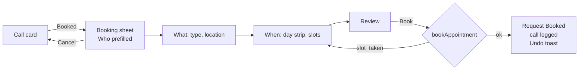
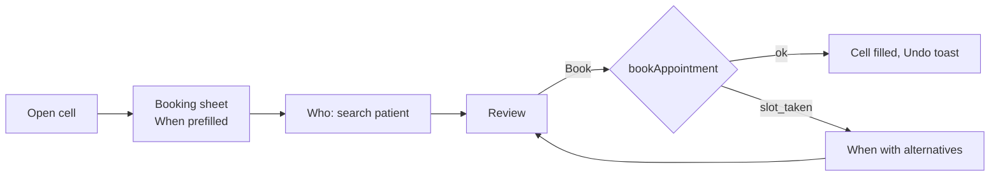
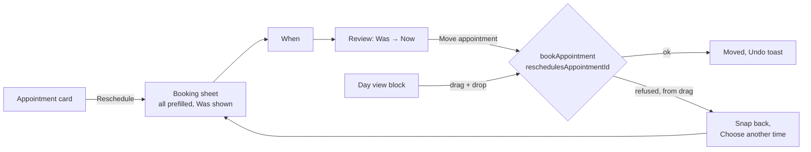

# Proposal: one booking model for the staff portal

- **Date:** 2026-10-04
- **Status:** Proposed. Design only; this pull request changes no code, schema, or UI.
- **Target:** `portal/appointment-workflow-experience`, the head of
  [#224](https://github.com/FDHS-Westchase-Gastroenterology/westchase-gi/pull/224). The proposal
  reaches `main` with #224.
- **Owner of the implementation:** one agent, end to end, on one branch, as one implementation pull
  request ([AGENTS.md, Task ownership](../../AGENTS.md#task-ownership)).

## 1. Summary

Booking a visit in the portal today happens through six entry points that behave in seven ways, read
availability through four different reads, and record "booked" in two places. Staff meet a different
calendar, a different set of defaults, and a different failure on each surface, and one of the seven
behaviors marks a request Booked without putting anything on the Schedule.

This proposal replaces that with one booking intent:

- **One record of "booked":** the appointment.
- **One contract:** `BookingDraft`.
- **One availability read:** `findOpenings`.
- **One write:** `bookAppointment`, which is atomic and returns recoverable conflicts.
- **One surface:** the Booking sheet. Every entry point prefills it and none forks it.

### Decisions already made

1. **The portal is the schedule.** Every booking creates or moves a real `appointments` row. The
   appointment is the single truth for "booked"; a request's Booked state is derived from it.
2. **Booked on the call card opens the booker.** "No answer / Contacted / Booked / Close" stays the
   call question. Choosing Booked opens the same Booking sheet every other entry point uses; the call
   card no longer carries its own booking calendar or time picker.
3. **One agent builds it, in order.** Server, migration, UI, tests, docs, and visual evidence are one
   task, built in the sequence in [section 9](#9-implementation-sequence) and landed as one pull
   request. Nothing is split across phases, follow-up pull requests, or another harness.

## 2. Current state

Paths are relative to `src/app/admin/(portal)/` unless they start with `src/` or `supabase/`.

| #   | Entry point                        | Surface                                                                                      | Availability read                                                                                                                            | Write                                                                                                         | Who / what / where                                                                                                                       |
| --- | ---------------------------------- | -------------------------------------------------------------------------------------------- | -------------------------------------------------------------------------------------------------------------------------------------------- | ------------------------------------------------------------------------------------------------------------- | ---------------------------------------------------------------------------------------------------------------------------------------- |
| 1a  | Home record card, unlinked request | `(home)/record-card.tsx`, `record-card-model.ts`, card calendar + `TimePicker`               | none; staff type a day and time                                                                                                              | `confirmBookingHandoff` (`requests/workflow-actions.ts:79`) via `record-card-save.ts`                         | No patient, no provider, no visit type. Sets `requests.status` and `appointment_at`; **creates no appointment**.                         |
| 1b  | Home record card, linked patient   | `use-record-booking.ts`, `parts/record-booking.tsx`, `parts/booking-day-popover.tsx`         | `month_availability` via `readCardMonth` (`(home)/booking-actions.ts:46`), then per-day `availability` in the popover                        | `bookFromCard` (`(home)/booking-actions.ts:96`) → scheduling `book`                                           | Visit type from `defaultTypeId` (name match). Office from the request's `RequestLocation`.                                               |
| 2   | Schedule request record, unlinked  | same hook as 1b, hosted by the Schedule                                                      | same as 1b                                                                                                                                   | `bookFromCard` with `patientId: null`: `patientForRequest` registers the patient, **then** a separate `book`  | Same defaults as 1b. Registration and booking are two transactions.                                                                      |
| 3   | Patient record, "Book another"     | `schedule/patient-booking-card.tsx` (reuses `RecordBookingMain` + `useRecordBooking`)        | same as 1b                                                                                                                                   | `bookFromCard` with no request                                                                                | Reuses the Home card's frame inside the Schedule.                                                                                        |
| 4   | Week or day open slot              | `schedule/week-open-card.tsx`                                                                | the grid cell from `week_schedule` / `day_schedule`                                                                                          | `bookOpenTime` (`schedule/week-actions.ts:221`) → `book`                                                      | Provider, location, and time fixed by the cell; patient found with `searchWeekPatients`; no request link.                                |
| 5   | Reschedule                         | `schedule/week-appointment-card.tsx` "reschedule" face → `RescheduleFace`                    | `availability` via `readRescheduleTimes` (`schedule/week-actions.ts:152`), with `appointmentTypeId: null` and a fixed 15-minute interval     | `weekAppointmentCommand` → `reschedule`                                                                       | Provider and location fixed to the current appointment; one day at a time.                                                               |
| 6   | Drag to move                       | `schedule/day-drag.tsx`, `day-drag-model.ts`                                                 | `can_place` via `canPlaceAppointment` (`schedule/week-actions.ts:396`)                                                                       | `weekAppointmentCommand` → `reschedule`                                                                       | Validity is checked per hover position rather than read as openings.                                                                     |

The server side is already closer to unified than the UI suggests. Every write above except 1a goes
through `executeSchedulingOperation` (`src/lib/portal/scheduling/service.ts:67`) into
`portal_execute_appointment_command`, and the four reads are separate `action`s of that same
operation (`src/lib/portal/scheduling/contracts.ts`, lines 180–271). The duplication is in the four
server actions layered on top, the four reads, and the three client draft models that feed them.

`add-appointment-dialog.tsx` is not a booking path. It exports `AddRequestDialog` and
`AddAppointmentDialog`, both hosting `StaffRequestForm`, and creates a **request**.

## 3. Problems

1. **Six entry points, four reads, three drafts.** Each surface chooses its own read
   (`month_availability`, `availability`, grid cells, `can_place`) and holds its own draft:
   `CardDraft` (`(home)/record-card-model.ts:90`), `BookingDraft` (`(home)/card-booking-model.ts:48`),
   and the week cards' local state. The same visit shows different openings depending on where staff
   started.
2. **"Booked" means two things.** On an unlinked Home request it calls `confirmBookingHandoff`,
   which records a time on the request and nothing on the Schedule (row 1a). On the Schedule, the
   same unlinked request registers a patient and books a real appointment (row 2). Which one happens
   depends on the page, not on what staff intended.
3. **Booking is shaped like a call outcome.** Booked sits in the call card's answer list
   (`cardRowsFor`, `record-card-model.ts:66`), so one calendar serves two jobs with different reach:
   `dayHorizon` gives a call-again 90 days and an appointment 400 (`record-card-model.ts:125`).
   The calendar changes meaning as the answer changes.
4. **Two records of "booked".** A request carries `status` and `appointment_at`; an appointment
   carries `source_request_id` and `request_workflow_managed`. Deferred constraint triggers
   (`portal_check_request_appointment`,
   `supabase/migrations/20260907010143_coordinate_requests_and_appointments.sql:55–80`) keep the two
   aligned, and reschedule and undo both rewrite `appointment_at` to follow the appointment
   (same file, lines 404 and 410). Row 1a writes only the request side, so its bookings exist only
   there.
5. **The same state has two names.** `RequestStatus` says `scheduled`; the card's `RequestState` says
   `booked` (`stateOf`, `record-card-model.ts:60`). The CONTEXT glossary says BOOKED.
6. **Registration is not atomic with booking.** `bookFromCard` registers the patient from the
   request, then books in a second call (`(home)/booking-actions.ts:103–117`). A taken slot after a
   successful registration leaves a new patient and no appointment.
7. **Defaults are guessed.** `defaultTypeId` picks the visit type whose name matches
   `/new[\s-]*patient/iu`, else the first type (`card-booking-model.ts:25`). Renaming a type in
   Settings changes booking behavior. Reschedule passes `appointmentTypeId: null` and a fixed
   15-minute interval instead of the appointment's own type.
8. **Location has two shapes.** Requests carry an office as `RequestLocation`; scheduling uses
   `locationId`, and grid reads add `locationName` (`src/lib/portal/scheduling/grid-contracts.ts:45`).
   The booking hook translates on every open.
9. **The draft carries modes, not choices.** `BookingDraft` holds `squeeze` ("Enter a time…") and
   `taken` (a start that went to someone else) beside the choice itself, and its reducer handles
   eight events whose effects depend on those modes (`card-booking-model.ts:91–150`).
10. **The docs disagree with the code.** CONTEXT.md defines the Booking handoff as the action that
    "does not create a portal Appointment" (lines 67–69, 94–99, 131–134). The Schedule now creates
    them, and this proposal makes that the only way.
11. **Names point the wrong way.** `add-appointment-dialog.tsx` adds a request. "Appointment
    scheduled" on the card may schedule nothing.

## 4. Principles

- **One intent, many doors.** Every entry point opens the same Booking sheet. An entry point
  contributes what it already knows (a patient, a request, a slot, an appointment to move); it never
  changes the steps, the rules, or the result.
- **The server decides; the sheet reflects.** Openings, conflicts, hours, and permissions come from
  the server. The sheet never computes availability and never hides a control as authorization.
- **One transaction per booking.** Registering from a request, creating or moving the appointment,
  linking the request, and logging the call either all happen or none do.
- **A conflict is a next step, not a dead end.** Every refusal arrives with what to do instead.
- **Choices, not modes.** The draft is the set of answers so far. Nothing in it says what the
  screen is doing.

## 5. Proposed data model

### 5.1 The appointment is the only record of "booked"

- A request is Booked when it has a live linked appointment: `appointments.source_request_id` set,
  `status <> 'cancelled'`. The request no longer stores its own booked time.
- The app stops writing `requests.appointment_at`. The read model derives "booked for" from the
  linked appointment. The column is kept read-only through the backfill (5.6) and dropped once
  nothing reads it.
- `requests.status` keeps one name for this state across the database, contracts, and UI. This
  proposal uses **Booked**, matching the CONTEXT glossary and the call card; `scheduled` is renamed
  in the same migration.
- The deferred alignment triggers in `20260907010143_coordinate_requests_and_appointments.sql`
  become a single rule: a request may be Booked only while a live appointment links to it. They no
  longer compare times, because the request no longer holds one.

### 5.2 `BookingDraft`

One contract in `src/lib/portal/scheduling/contracts.ts` replaces `CardDraft`'s booking fields,
`(home)/card-booking-model.ts`'s `BookingDraft`, and the week cards' local state:

```ts
type BookingDraft = {
  patient:
    | { kind: "existing"; patientId: string }
    | { kind: "from_request"; requestId: string }; // registered inside bookAppointment
  sourceRequestId: string | null; // the request this booking resolves, if any
  reschedulesAppointmentId: string | null; // set when moving an existing appointment
  visitTypeId: string;
  locationId: string;
  providerId: string | "any";
  slotStart: string | null; // ISO instant from findOpenings, or an "Other time" the server checks
};
```

The draft holds only answers. "Enter a time…" and "a time someone else took" become outcomes of the
read and the write (5.3, 5.4) rather than fields.

### 5.3 One read: `findOpenings`

```ts
findOpenings({
  visitTypeId, locationId, providerId /* id | "any" */,
  from, to,                       // practice-local days
  patientId?, reschedulesAppointmentId?,
}) → {
  days: { day: string; open: number; past: boolean }[];   // drives the day strip
  slots: { start: string; providerId: string; providerName: string }[]; // for the chosen day
  typeVersion: string;
}
```

- It replaces `month_availability`, `availability`, and `can_place` as **booking** reads. The week
  and day grids keep `week_schedule` / `day_schedule` for drawing the Schedule, but an open cell
  books through the sheet, and the sheet reads `findOpenings`.
- Drag-to-move asks `findOpenings` for the target day once, on drag start, and snaps to returned
  slots instead of calling `can_place` per hover position.
- Reschedule passes `reschedulesAppointmentId` so the appointment's own time does not block it, and
  uses the appointment's visit type, not `null`.
- `providerId: "any"` returns slots across every provider seeing that visit type at that location,
  each slot naming its provider.

### 5.4 One write: `bookAppointment`

One Server Action calls one SQL command, `book_appointment`, through the existing
`executeSchedulingOperation` path with an idempotency key. In one transaction it:

1. registers the patient when `patient.kind === "from_request"` (today's `patientForRequest`);
2. creates the appointment, or moves `reschedulesAppointmentId`, keeping its history and undo;
3. links `sourceRequestId` and sets the request Booked;
4. logs the call on the request as Booked when the sheet was opened from the call card.

```ts
type BookAppointmentResult =
  | { ok: true; appointmentId: string; undoToken: string }
  | { ok: false; code: "slot_taken"; alternatives: Slot[] } // the next three openings
  | { ok: false; code: "outside_hours"; alternatives: Slot[] }
  | { ok: false; code: "patient_conflict"; existing: { appointmentId: string; start: string } }
  | { ok: false; code: "forbidden" }
  | { ok: false; code: "invalid"; field: keyof BookingDraft };
```

`bookFromCard`, `bookOpenTime`, the booking half of `weekAppointmentCommand`, and
`confirmBookingHandoff` are removed. Cancel, check-in, complete, and no-show stay on
`weekAppointmentCommand`; undo stays on `undoAppointmentChange` (`schedule/week-actions.ts:236`).

### 5.5 Defaults are data

- `appointment_types.is_default_for_new_patient boolean`, at most one true per practice, set in
  Settings → Appointment types. It replaces the name match in `defaultTypeId`.
- Locations travel as `locationId` everywhere. A request's office maps to a `locationId` once, when
  the request is read, and the booking hook stops translating.
- Provider defaults to "Any provider". The week view's remembered provider
  (`remember_week_provider`) prefills it when booking from the Schedule.

### 5.6 Existing handoff-only bookings

Requests that are Booked with an `appointment_at` and no linked appointment were written by path 1a.
The migration:

1. lists them for review (request, time, office) before any change;
2. creates an appointment where the patient, a provider, and the time resolve unambiguously
   against that day's hours, linked to the request, with history noting the backfill;
3. leaves the rest Booked and marks them **Needs a slot** in the worklist, so staff book them through
   the sheet. Nothing is silently dropped or reopened.

The implementation agent writes this migration and runs it on the Preview Branch only. It is not
written or run in this pull request.

## 6. Proposed interaction model

### 6.1 The Booking sheet

One native `<dialog>` glass sheet in the family of `AddAppointmentDialog` and `PrintRequestsSheet`
([overlays.md, Modal dialogs](../../design-system/overlays.md#modal-dialogs)), following their parts,
focus, keyboard-instant, and Escape rules. Booking is an "answer before anything else" task, so it
is a modal, not a popover or a second sheet.

Four sections, top to bottom. Each collapses to a one-line summary once answered and reopens on
press:

1. **Who.** The patient, or the requester to be registered from the request ("New patient from
   this request"). Search when nothing is prefilled.
2. **What.** Visit type and location, as two chip rows. The new-patient default comes from 5.5.
3. **When.** A two-week day strip with open counts (from `findOpenings.days`), then the chosen day's
   slots as a list, each naming its provider. A provider filter defaults to "Any provider". "Other
   time…" at the end of the list accepts a time the server checks on Book; it replaces the card's
   `squeeze` mode.
4. **Review & book.** One sentence ("Maria L. · New patient visit · Tue Oct 14, 9:30 AM · Dr. Shah ·
   Westchase") and one primary **Book** button. A reschedule shows "Was → Now" and the button reads
   **Move appointment**.

Copy follows [vocabulary.md](../../design-system/vocabulary.md), dates and times follow
[dates-and-times.md](../../design-system/dates-and-times.md), and results are reported through
`toast.promise` ([forms.md](../../design-system/forms.md)).

### 6.2 Prefill per entry point

| Entry point                     | Who                   | What                                 | When                          | Section shown open |
| ------------------------------- | --------------------- | ------------------------------------ | ----------------------------- | ------------------ |
| Call card → Booked              | the request           | default type, the request's location | —                             | When               |
| Schedule request record         | the request           | default type, the request's location | —                             | When               |
| Patient record → "Book another" | the patient           | default type, last location          | —                             | What               |
| Week / day open slot            | —                     | default type, the cell's location    | the cell's provider and start | Who                |
| Reschedule                      | the appointment's     | the appointment's                    | current start (shown as Was)  | When               |
| Drag to move                    | no sheet; see 6.4     |                                      |                               |                    |

### 6.3 Booking from a call

The call card keeps its four answers. Choosing **Booked** opens the Booking sheet over the card:

- **Book succeeds:** the sheet closes, the call is logged as Booked inside the same transaction, the
  card shows the booked line, and the toast offers Undo.
- **Sheet cancelled:** the card returns exactly as it was, with no answer chosen. Nothing is saved.

The card's own calendar and `TimePicker` remain only for Call again. Their reach is the 90-day
call-again horizon; the 400-day booking horizon moves to `findOpenings`.

### 6.4 Conflicts and recovery

- **Slot taken / outside hours:** the When section reopens with an inline notice ("9:30 went to
  another patient") and the three `alternatives` listed first. The rest of the draft is kept.
- **Patient conflict:** Review shows the existing visit and asks whether to book anyway or move that
  one instead. The policy is an open question (section 11).
- **Drag to move:** stays a direct shortcut on the day view. On drop it calls `bookAppointment` with
  `reschedulesAppointmentId`. A refusal snaps the block back and offers "Choose another time",
  which opens the sheet in reschedule mode. Success shows an Undo toast.

## 7. Flows

### 7.1 Booking from a request



### 7.2 Booking from an open slot



### 7.3 Reschedule and drag



### 7.4 Low-fidelity layout

1440 wide, When open:

```text
┌ Book a visit ────────────────────────────────────────── × ┐
│ Who    Maria Lopez · from request, new patient        Edit │
│ What   New patient visit · Westchase                  Edit │
│ When                                                       │
│   ‹ Mon 13  Tue 14  Wed 15  Thu 16  Fri 17 … ›             │
│      4       6       0       2       5                     │
│   Provider: Any provider ▾                                 │
│   9:00 AM   Dr. Shah                                       │
│   9:30 AM   Dr. Shah                                       │
│   10:15 AM  Dr. Patel                                      │
│   Other time…                                              │
├────────────────────────────────────────────────────────────┤
│                                     Cancel   [  Book  ]    │
└────────────────────────────────────────────────────────────┘
```

390 wide: the same sections in one column, the day strip scrolls sideways, and the actions stack
full-width per the modal parts rule.

```text
┌ Book a visit ───────── × ┐
│ Who   Maria Lopez   Edit │
│ What  New patient…  Edit │
│ When                     │
│ ‹ Tue 14 Wed 15 Thu 16 › │
│   Any provider ▾         │
│   9:00 AM · Dr. Shah     │
│   9:30 AM · Dr. Shah     │
│   Other time…            │
├──────────────────────────┤
│ [        Book          ] │
│ [       Cancel         ] │
└──────────────────────────┘
```

## 8. What gets removed

| Today                                                                                         | Replaced by                                       |
| --------------------------------------------------------------------------------------------- | ------------------------------------------------- |
| `confirmBookingHandoff` and `confirm_booking_handoff` writes; the call card's booking time    | Booked opens the sheet; `bookAppointment`         |
| `bookFromCard`, `readCardMonth` (`(home)/booking-actions.ts`)                                 | `bookAppointment`, `findOpenings`                 |
| `bookOpenTime`, `readRescheduleTimes`, `canPlaceAppointment` (`schedule/week-actions.ts`)     | `bookAppointment`, `findOpenings`                 |
| `(home)/card-booking-model.ts`, `card-booking-days.ts`, `use-card-booking.ts`, `use-card-month.ts`, `use-record-booking.ts` | one sheet model built on `BookingDraft` |
| `(home)/parts/booking-day-popover.tsx`, `booking-calendar.tsx`, `booking-strip.tsx`, `record-booking.tsx` | the sheet's When section            |
| `schedule/week-open-card.tsx` booking face, `RescheduleFace`, `schedule/patient-booking-card.tsx` booking frame | the sheet, opened with prefill  |
| `defaultTypeId` name match                                                                    | `is_default_for_new_patient`                      |
| `requests.appointment_at` writes; `scheduled` status name                                     | derived from the appointment; **Booked**          |
| `AddAppointmentDialog` name for the add-request sheet                                         | `AddRequestSheet` (rename only)                   |

## 9. Implementation sequence

One agent, one branch, one implementation pull request into `portal/appointment-workflow-experience`.
Each step depends on the one before it and ends in a local commit, so reviewers can read the work as
a stack. No step is handed to another agent or harness, and none ships separately.

1. **Contract.** Add `BookingDraft`, the `findOpenings` input and output, and
   `BookAppointmentResult` to `src/lib/portal/scheduling/contracts.ts`, with Zod schemas. The UI is
   built against this contract and nothing else.
2. **Migration.** Add `is_default_for_new_patient`; add `book_appointment` (register → create or
   move → link → log the call, one transaction); replace the alignment triggers with the
   live-appointment rule; rename `scheduled` to Booked; stop `appointment_at` writes. Run the
   handoff-row review query, then the backfill from 5.6, on the Preview Branch only.
3. **Server.** Implement `findOpenings` and `bookAppointment` in `src/lib/portal/scheduling/service.ts`
   and the Server Action, with unit and integration tests for every result code and for idempotent
   retries.
4. **Booking sheet.** Build it from `ui/` recipes on the native `<dialog>` modal pattern, copying
   `PrintRequestsSheet` and wrapping Tab by hand (overlays.md item 9). It reads only the step 1
   contract.
5. **Switch entry points**, in this order: open slot, patient "Book another", Schedule request
   record, call card (Booked opens the sheet), reschedule, then drag-to-move with Undo.
6. **Delete** everything in section 8. Search the repository for each removed identifier and
   `appointment_at` writes; nothing may still reference them.
7. **Docs.** CONTEXT.md glossary (Booking handoff → Appointment; Booked derived from it), PRODUCT.md
   staff-portal register, ARCHITECTURE.md change-type map, FRONTEND-HANDOFF.md checklist, and
   overlays.md's modal list (a fourth modal).
8. **Verify and land.** E2E acceptance paths for all six entry points plus slot-taken recovery and
   Undo. Refresh the affected `ui-reference/` atlas pages with the Preview Branch seed identity.
   Post videos of request → booked, open slot → booked, and reschedule and drag, plus screenshots of
   the sheet at 1440×900 and 390×844, in the pull-request conversation. Pass oxlint, oxfmt,
   React Doctor at 100, `npm run build`, and the `review-animations` verdict for the sheet's motion.

## 10. Acceptance criteria

The implementation is done when all of these hold:

- Every booking and reschedule, including drag, calls `bookAppointment`.
- No code writes `requests.appointment_at` or calls `confirm_booking_handoff`.
- A request is Booked if and only if a live appointment links to it, and the UI reads it that way.
- Registering from a request and booking succeed or fail together.
- Each of the six entry points books, recovers from a taken slot without losing the draft, and can
  be undone, in the e2e suite.
- No handoff-only Booked request is left unlisted: each one either has an appointment or shows
  Needs a slot.
- The standing contribution gates pass and the visual evidence is posted.

## 11. Open questions

1. **Patient conflict.** Should a second visit for the same patient on the same day be refused,
   warned, or allowed? This proposal assumes warn and allow.
2. **"Any provider" order.** When several providers share a time, which is listed first: the
   remembered week provider, the least-booked provider that day, or alphabetical?
3. **Cancelled appointment, open request.** When a booked appointment is cancelled, does its request
   reopen to the worklist or close? Today `cancel` accepts `callAgainOn`; this proposal assumes the
   request reopens with that callback.
4. **Backfill rules.** Is "patient, provider, and time resolve unambiguously" strict enough, or
   should every handoff-only row go to Needs a slot for a person to book?
5. **"Other time…".** Keep a server-checked off-grid time, as proposed, or remove it and require
   staff to change hours first?
6. **A fourth modal.** The overlay tree reserves modals for short answers. The Booking sheet is a
   modal by that rule's intent (staff must finish or cancel before anything else), but it is larger
   than the current three. Confirm before step 4.
